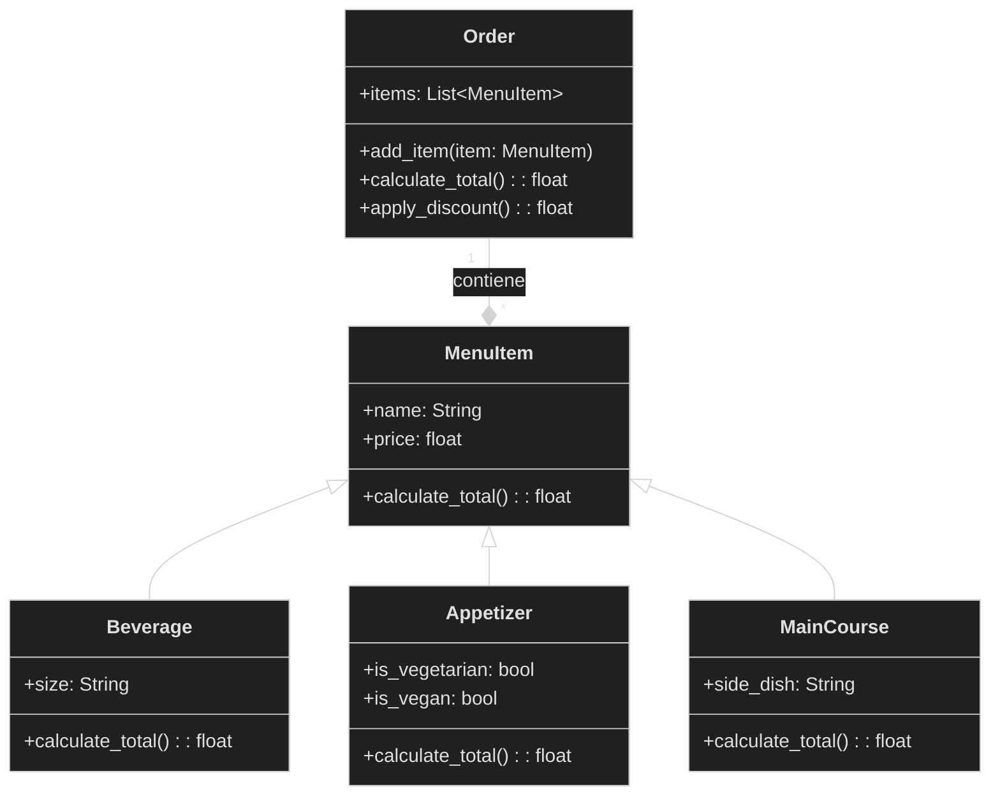

# Reto-03

En este reto se usaran las bases vistas en clase como herencia, composición y encapsulamiento en la programación orientada a objetos. 

# Ejercicio 1
1. Cree la clase Rectangle y la clase Line.
   
2. El rectángulo debe inicializarse utilizando cualquiera de estos 3 métodos:

  - **Método 1**: Esquina inferior izquierda (Punto) + ancho y alto
  - **Método 2**: Centro(Punto) + ancho y alto
  - **Método 3**: Dos esquinas opuestas (puntos), por ejemplo, inferior izquierda y superior derecha.
    ancho , alto , centro: atributos de instancia

  - **compute_area()**: debe devolver el área del rectángulo
  - **compute_perimeter()**: debe devolver el perímetro del rectángulo

3. Cree una clase **Square()** que herede los atributos y métodos necesarios de Rectangle.
   
4. Cree un método llamado **compute_interference_point(Point)** que devuelva si un punto está dentro de un rectángulo.

5. La linea debe inicializarse con las siguientes carácteristicas y metodos.

  - **length, slope, start, end**: atributos de instancia, dos de ellos son puntos (por lo que una línea se compone al menos de dos           puntos).
  - **compute_length()**: debe devolver la longitud de la línea
  - **compute_slope()**: debe devolver la pendiente de la línea desde la horizontal en grados.
  - **compute_horizontal_cross()**: debe devolver si existe la intersección con el eje x
  - **compute_vertical_cross()**: debe devolver si existe la intersección con el eje y
    
6. Redefinir la clase **Rectángulo**, agregando un nuevo método de inicialización utilizando 4 Líneas (la composición en su mejor expresión, un rectángulo se compone de 4 líneas).

# Código:

``` Python
class Point:
    def __init__(self, x: float, y: float) -> None:
        self.x = x
        self.y = y

class Line(Point):
    def __init__(self, start: Point, end: Point) -> None:
        super().__init__(start.x, start.y)
        self.start = start
        self.end = end

    def compute_length(self) -> float:
        length = ((self.end.x - self.start.x) ** 2 + (self.end.y - self.start.y) ** 2) **0.5
        return length
    
    def compute_slope(self) -> float:
        if self.end.x == self.start.x:
            return None
        slope = (self.end.y - self.start.y) / (self.end.x - self.start.x)
        return slope

    def compute_horizontal_cross(self) -> float:
        slope = self.compute_slope()
        if slope is None:
            return self.start.x
        if slope == 0:
            return None
        x_intercept = self.start.x - self.start.y / slope
        return x_intercept
    
    def compute_vertical_cross(self) -> float:
        slope = self.compute_slope()
        if slope is None:
            return None
        y_intercept = self.start.y - slope * self.start.x
        return y_intercept

    def __str__(self) -> str:
        return (
            f"Longitud: {self.compute_length()}, "
            f"Pendiente: {self.compute_slope()}, "
            f"Corte Horizontal: {self.compute_horizontal_cross()}, "
            f"Corte Vertical: {self.compute_vertical_cross()}"
        )
        
class rectangle:
    #Método 2: Desde el centro, ancho y alto
    def __init__(self, width: float, height: float, center: Point):
        self.width = width
        self.height = height
        self.center = center

    @classmethod
    def from_bottom_left(cls, bottom_left: Point, width: float, height: float):
        center_x = bottom_left.x + width / 2
        center_y = bottom_left.y + height / 2
        return cls(width, height, Point(center_x, center_y))

    @classmethod
    def from_corners(cls, p1: Point, p2: Point):
        width = abs(p1.x - p2.x)
        height = abs(p1.y - p2.y)
        center_x = (p1.x + p2.x) / 2
        center_y = (p1.y + p2.y) / 2
        return cls(width, height, Point(center_x, center_y))

    @classmethod
    def from_lines(cls, line1: Line, line2: Line, line3: Line, line4: Line):
        puntos = [line1.start, line1.end, line2.start, line2.end, line3.start, line3.end, line4.start, line4.end]
        xs = [p.x for p in puntos]
        ys = [p.y for p in puntos]
        width = abs(max(xs) - min(xs))
        height = abs(max(ys) - min(ys))
        center = Point((max(xs) + min(xs)) / 2, (max(ys) + min(ys)) / 2)
        return cls(width, height, center)
    
    def bounds(self):
        half_width = self.width / 2
        half_height = self.height / 2

        center_x = self.center.x
        center_y = self.center.y

        x_min = center_x - half_width
        y_min = center_y - half_height
        x_max = center_x + half_width
        y_max = center_y + half_height

        return {"x_min": x_min, "y_min": y_min, "x_max": x_max, "y_max": y_max}

    def corners(self):
        bounds = self.bounds()
        x_min = bounds["x_min"]
        y_min = bounds["y_min"]
        x_max = bounds["x_max"]
        y_max = bounds["y_max"]

        bottom_left = (x_min, y_min)
        bottom_right = (x_max, y_min)
        top_left = (x_min, y_max)
        top_right = (x_max, y_max)

        return {
            "Inferior_Izquierdo": bottom_left,
            "Inferior_Derecho": bottom_right,
            "Superior_Izquierdo": top_left,
            "Superior_Derecho": top_right
        }
    
    def compute_interference_point(self, point: Point) -> bool:
        bounds = self.bounds()
        x_min = bounds["x_min"]
        y_min = bounds["y_min"]
        x_max = bounds["x_max"]
        y_max = bounds["y_max"]
        return (x_min <= point.x <= x_max) and (y_min <= point.y <= y_max)

    def computer_area(self):
        return self.width * self.height
    
    def computer_perimeter(self):
        return 2 * (self.width + self.height)
    
class square(rectangle):
    def __init__ (self, side_length: float, center: Point):
        super().__init__(side_length, side_length, center)

    def computer_area(self):
        return self.width ** 2
    
    def computer_perimeter(self):
        return 4 * self.width

#Límites, esquinas, área y perímetro del rectángulo
print("--- Rectángulo ---")
print("Elige el método para crear el rectángulo:")
print("1. Esquina inferior izquierda + ancho y alto")
print("2. Centro + ancho y alto")
print("3. Dos esquinas opuestas")
print("4. Cuatro líneas\n")

opcion = input("Ingresa 1, 2, 3 o 4: ")

if opcion == "1":
    datos = input("\nIngresa (x,y) de la esquina inferior izquierda, ancho y alto (separados por espacios): ").split()
    esquina = Point(float(datos[0]), float(datos[1]))
    ancho = float(datos[2])
    alto = float(datos[3])
    rect = rectangle.from_bottom_left(esquina, ancho, alto)

elif opcion == "2":
    datos = input("\nIngresa ancho, alto, (x,y) del centro (separados por espacios): ").split()
    ancho = float(datos[0])
    alto = float(datos[1])
    centro = Point(float(datos[2]), float(datos[3]))
    rect = rectangle(ancho, alto, centro)

elif opcion == "3":
    datos = input("\nIngresa (x,y) de la primera esquina y (x,y) de la segunda esquina (separados por espacios): ").split()
    p1 = Point(float(datos[0]), float(datos[1]))
    p2 = Point(float(datos[2]), float(datos[3]))
    rect = rectangle.from_corners(p1, p2)

elif opcion == "4":
    print("\nIngresa los puntos de las 4 líneas (cada línea: x1 y1 x2 y2):")
    lineas = []
    for i in range(4):
        datos = input(f"Línea {i+1}: ").split()
        p1 = Point(float(datos[0]), float(datos[1]))
        p2 = Point(float(datos[2]), float(datos[3]))
        lineas.append(Line(p1, p2))
    rect = rectangle.from_lines(lineas[0], lineas[1], lineas[2], lineas[3])

else:
    print("Opción no válida.")
    rect = None

if rect:
    bounds_rectangle = rect.bounds()
    print(f"Los límites del rectángulo son: {bounds_rectangle}")
    corners_rectangle = rect.corners()
    print(f"Las esquinas del rectángulo son: {corners_rectangle}")
    area_rectangle = rect.computer_area()
    print(f"El área del rectángulo es: {area_rectangle}")
    perimeter_rectangle = rect.computer_perimeter()
    print(f"El perímetro del rectángulo es: {perimeter_rectangle}")

    # Comprobar si un punto está dentro del rectángulo
    user_point1 = input("Ingrese las coordenadas del primer punto (x y): ").split()
    user_point2 = input("Ingrese las coordenadas del segundo punto (x y): ").split()

    point1 = Point(float(user_point1[0]), float(user_point1[1]))
    point2 = Point(float(user_point2[0]), float(user_point2[1]))

    print(f"¿El punto {point1.x, point1.y} está dentro del rectángulo?: {rect.compute_interference_point(point1)}")
    print(f"¿El punto {point2.x, point2.y} está dentro del rectángulo?: {rect.compute_interference_point(point2)}")
        
# Límites, esquinas, área y perímetro del cuadrado
print("\n--- Cuadrado ---")
user2 = input("Ingrese el lado y centro del cuadrado (x,y), separados por espacios: ").split()
side_sq = float(user2[0])
center_sq = Point(float(user2[1]), float(user2[2]))
sq = square(side_sq, center_sq)

bounds_square = sq.bounds()
print(f"Los límites del cuadrado son: {bounds_square}")
corners_square = sq.corners()
print(f"Las esquinas del cuadrado son: {corners_square}")
area_square = sq.computer_area()
print(f"El área del cuadrado es: {area_square}")
perimeter_square = sq.computer_perimeter()
print(f"El perímetro del cuadrado es: {perimeter_square}") 
```

# Reto-03:

1. Escenario de restaurante: desea diseñar un programa para calcular la factura del pedido de un cliente en un restaurante.
 
  - **Definir una clase base MenuItem**: Esta clase debe tener atributos como nombre, precio y un método para calcular el precio total.
  - **Cree subclases para diferentes tipos de elementos de menú**: herede de MenuItem y defina propiedades específicas para cada tipo         (por ejemplo, Bebida, Aperitivo, Plato principal).
  - **Definir una clase Order**: Esta clase debe tener una lista de objetos MenuItem y métodos para agregar artículos, calcular el monto      total de la factura y potencialmente aplicar descuentos específicos según la composición del pedido.

Cree un diagrama de clases con todas las clases y sus relaciones. El menú debe tener al menos 10 elementos. El código debe seguir las reglas PEP8.

# Diagrama: 



# Código:
